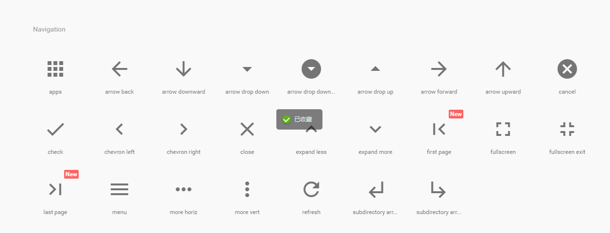

### iconfont MDL


```html
首页 
	<i class="material-icons">home</i>

全部在售 sell hot

	<i class="material-icons">explore</i> 
	<i class="material-icons">local_grocery_store</i> 
	<i class="material-icons">local_offer</i> 
	<i class="material-icons">apps</i>


经销商 
	<i class="material-icons">supervisor_account</i> 
	<i class="material-icons">group</i>


品牌故事 简介 
	<i class="material-icons">description</i>


地图  
	<i class="material-icons">room</i> <i class="material-icons">place</i>

电话 
	<i class="material-icons">call</i> <i class="material-icons">phone</i>


购买须知 
	<i class="material-icons">list</i>


右箭头 <i class="material-icons">chevron_right</i>
左箭头 <i class="material-icons">chevron_left</i> <i class="material-icons">arrow_back</i>
下箭头 <i class="material-icons">arrow_downward</i>
```


#  

如图:

