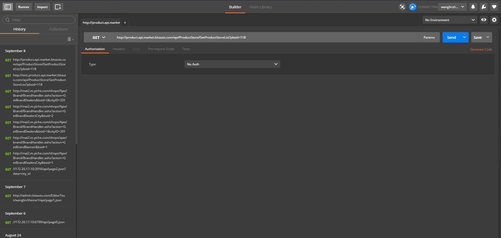

## JS 常用工具

###  json 格式监测工具

http://jsonlint.com/  

### jshint
http://jshint.com/

大名鼎鼎的jshint  同类型的,还有jslint ,当然可以作为插件安装到vscode atom等编辑器.

### jsbin

http://jsbin.com/riyitapoho/1/

js在线调试工具

### postman

ajax 必备神器 谷歌插件 

