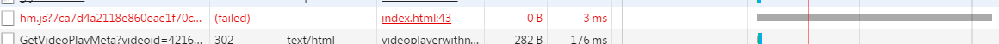
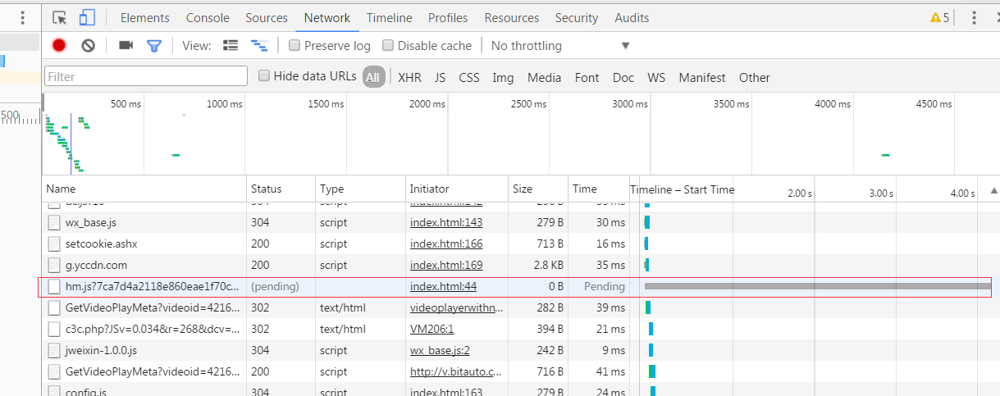

# 性能优化:百度监测的async处理


作专题的经验中,发现页面加载的很慢很慢....


打开页面的时候,可以通过F12->network.看那个加载的最长的 那个,很可能就是百度监测的锅.



解决这个办法有个很简单的办法.就是对监测代码的`script`添加`async` 属性.


这个办法我是意外在和冬冬以及浩哥撕的过程中在小米的官网里看到的....

在监测代码里加这么一句

```javascript
hm.aysnc=true
```


完整示意:

```javascript
<!-- 百度监测 -->
  <script>
  var _hmt = _hmt || [];
  (function() {
    var hm = document.createElement("script");
    hm.src = "//hm.baidu.com/hm.js?b86f0004c84fb6c8adbc7d6e0526da16";
    hm.async=true;
    var s = document.getElementsByTagName("script")[0];
    s.parentNode.insertBefore(hm, s);
  })();
  </script>
```


之后会怎么样呢?

如下图:




原理:async 异步加载.