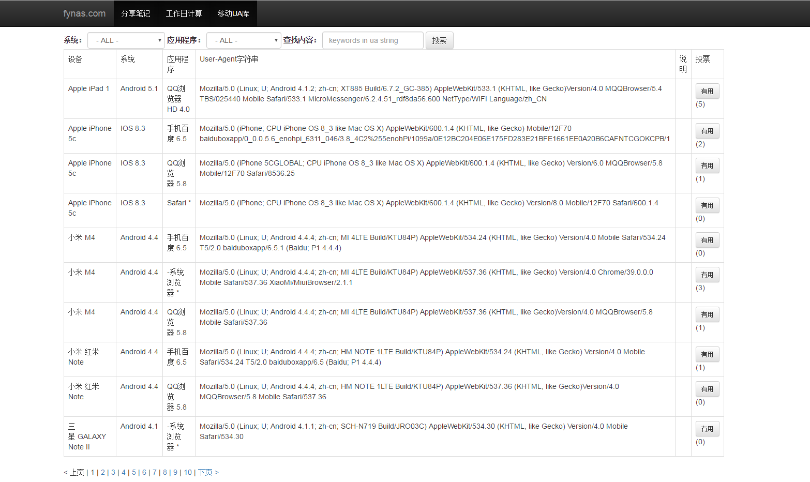

##  正则 匹配不同的浏览器


```javascript
<script type="text/javascript">
var isMQQBrowser = /mqqbrowser/i.test(navigator.userAgent.toLowerCase());
var isUCBrowser=/ucbrowser/i.test(navigator.userAgent.toLowerCase());
var isWx = /micromessenger/i.test(navigator.userAgent.toLowerCase());
</script>
```


http://www.fynas.com/ua


